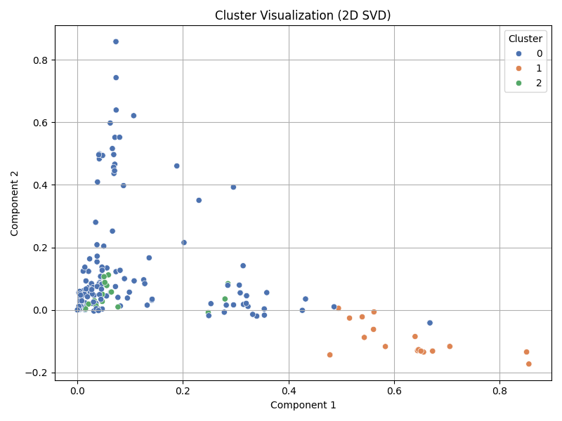
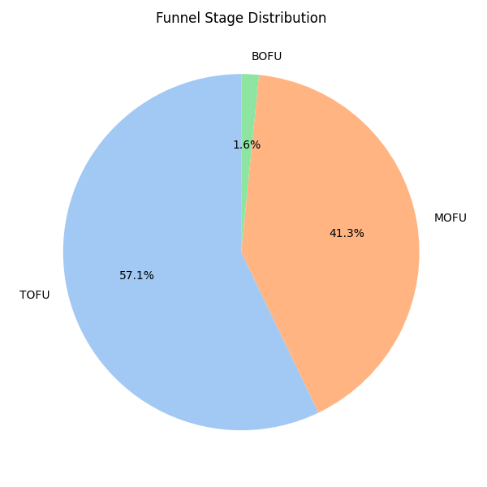

# Quora Mind

*Automatically discover, clean, and classify FAQs from raw datasets.*


FAQ Extractor is a Python pipeline that transforms messy customer queries into structured, labeled, and clustered FAQs.
It helps **support teams, marketers, and chatbot developers** by automatically detecting questions, cleaning text, tagging entities, and assigning funnel stages.

Instead of manually curating thousands of queries, FAQ Extractor generates a ready-to-use **knowledge base** in minutes.

---

## 📑 Table of Contents

- [Quora Mind](#quora-mind)
  - [📑 Table of Contents](#-table-of-contents)
  - [Features](#features)
  - [Technology Stack](#technology-stack)
  - [Demo and Preview](#demo-and-preview)
  - [Installation](#installation)
  - [Usage](#usage)
  - [Configuration](#configuration)
  - [License](#license)
  - [Acknowledgments](#acknowledgments)
  - [FAQs](#faqs)
  - [Contact](#contact)

---

##  Features

*  Multi-file ingestion (CSV merge)
*  Text cleansing & normalization
*  Question detection + typing (what, how, why)
*  Named-entity recognition (products, dates, people)
*  Zero-shot funnel classification (Awareness → Advocacy)
*  Clustering & visualization (KMeans + TF-IDF + SVD)
*  Exports clean CSV + PNG charts

---

##  Technology Stack

* **Language:** Python 3.9+
* **NLP:** spaCy, NLTK
* **ML:** scikit-learn, transformers, torch
* **Data:** pandas, numpy
* **Visualization:** matplotlib, seaborn
* **Configuration:** python-dotenv

---

##  Demo and Preview

*  Example clustering visualization:
  
    


*  Example funnel stage distribution:
  
    

---

##  Installation

```bash
# Clone repo
git clone https://github.com/Jay-Shah--92/faq-extractor.git
cd faq-extractor

# Create & activate virtual environment
python -m venv venv
source venv/bin/activate   # Windows: venv\Scripts\activate

# Install dependencies
pip install -r requirements.txt
python -m spacy download en_core_web_sm
```

---

##  Usage

1. Drop raw CSVs into `data/input/`

   * Required column: `title` (user query)
   * Optional: `keyword`

2. Run pipeline:

   ```bash
   python main.py
   ```

3. Check `data/output/` for:

   * `questions_final.csv`
   * PNG charts (confidence, funnel, clustering)

---

##  Configuration

Customize `.env` file:

```env
INPUT_FOLDER=./data/input
OUTPUT_FILE=./data/output/questions_final.csv
```

---

## License

This project is licensed under the [MIT License](LICENSE).  


---

##  Acknowledgments

* spaCy & Hugging Face teams
* scikit-learn community
* Inspired by real-world customer-support mining projects

---

##  FAQs

* **Q: Does it work with languages other than English?**
  A: Currently, English only. Future multilingual support planned.

* **Q: What if my CSV doesn’t have a `title` column?**
  A: Please rename your query column to `title`.

---

##  Contact

For questions or collaboration:

* **Author**: Jay Shah
* **Email**: [jayshah92.ca@gmnail.com](mailto:jayshah92.ca@gmail.com)
* **GitHub**: [Jay-Shah-92](https://github.com/Jay-Shah-92)
